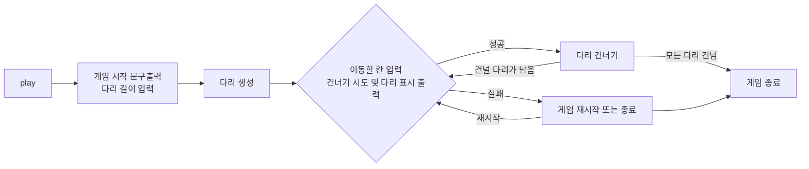

## 서비스 흐름도

## 목표

- 다리 길이를 입력 받아 다리를 생성한다.
  - 생성된 다리는 위칸과 아래칸으로 구성되며 하나의 길이에 한칸만 건널 수 있다.
- 플레이어는 위칸과 아래칸 중 하나를 선택하여 다리를 건넌다.
  - 만일 건널 수 없는 다리는 선택한다면 게임 실패
    - 게임이 실패된다면 재시작하거나, 게임을 완전 종료할 수 있다.
  - 만일 건널 수 있다면 모든 다리 길이를 건널때까지 다리를 건넌다.
- 다리를 다 건넌다면 게임 성공

## 기능구현목록

1. 다리길이 입력 받기 `BridgeGame` -> `BridgeMaker 객체`
   - [ ] 입력 받은 다리 길이에 대한 다리 생성하기
   - [ ] 다리를 생성할 때 위 칸과 아래 칸 중 건널 수 있는 칸은 0과 1 중 무작위 값을 이용해서 정한다. `BridgeMaker` -> `BridgeRandom 객체`
2. 플레이어가 이동할 칸 입력 받기 `BridgeGame` -> `input 함수`
   - [ ] 위칸은 U, 아래칸은 D를 입력 받는다.
   - [ ] 이동한 칸을 건널 수 있다면 O로 표시한다. 건널 수 없다면 X로 표시한다. `array` => `[0, 1, 0, 1, 0]`
3. 입력 받은 칸을 통한 다리 건너기
   - [ ] 게임 실패한 경우 `BridgeGame` -> `BridgeResult 객체`
     - 플레이어가 건널 수 없는 다리를 선택한 경우 게임 실패 `BridgeResult 내 check 함수`
     - 게임을 재시작하거나, 게임 종료를 선택할 수 있다. `if return으로 성공 여부 리턴`
     - 만일 재시작할 경우 다리 객체는 여전히 존재하고, 플레이어의 이전의 선택은 초기화된다. `재시작 시 BridgeResult 객체 초기화`
   - 게임 성공한 경우
     - 게임 성공 여부 메세지와 총 시도한 횟수를 출력한다. `BridgeResult 내 필드`
4. 게임 종료

## 클래스 단위

- BridgeMaker
  - `다리 길이`를 `InputView`를 통해 인자로 받아 `BridgeRandom`의 객체 사용하여 다리를 만드는 클래스
  - 인자로 받은 다리 길이에 대한 유효성 검사 필요
  - 필드 => `BridgeState`가 존재
- BridgeGame
  - 전체적 게임을 진행하는 클래스
    - 필드는 `BridgeResult`를 활용한 `Result` 객체가 존재
    - 또한 현재 위치를 말하는 `nowPosition` 인자 존재
    - run() => 시작 문구 출력 및 다리 길이 입력 받는 메소드
    - 이후 BridgeMaker 클래스를 통한 Bridge 객체 생성
    - inputMove() => 이동할 칸을 입력 받는 메소드, 결과 출력 메소드 실행
    - printResult() => Result 객체 내 결과 값 불러오는 메소드 실행, 인자는 Bridge와 inputMove으로 입력 받은 인자
- BridgeRandom
  - 길이를 입력 받아서 다리에 대한 배열 값 리턴하는 클래스
  - 랜덤 변수를 2로 나누어 0, 1을 길이만큰 리턴하는 객체
- BridgeResult
  - 결과를 가지고 있는 클래스
  - `nowBridge` 필드는 플레이어가 현재까지 이동한 배열을 가지고 있음
  - MoveOnBridge() => `(다리객체, 현재 위치, 이동할 칸)`을 인자로 받아서 움직일 수 있는지 없는지를 리턴하는 함수
  -

## 유효성 검사

## 상수

- message
  - start - 다리 건너기 게임을 시작합니다.
  - lengthInput -다리의 길이를 입력해주세요.
  - moveInput - 이동할 칸을 선택해주세요. (위: U, 아래: D)
  - moveSelect - 이동할 칸을 선택해주세요. (위: U, 아래: D)
  - gameRestart - 게임을 다시 시도할지 여부를 입력해주세요. (재시도: R, 종료: Q)
  - finalResult - (result, attempts) 최종 게임 결과 \n게임 성공 여부: {$result}\n총 시도한 횟수 : {$attempts}
